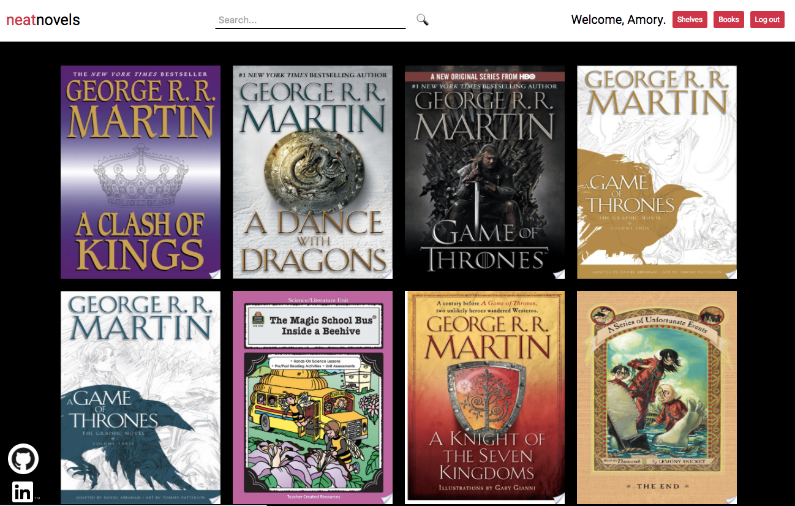
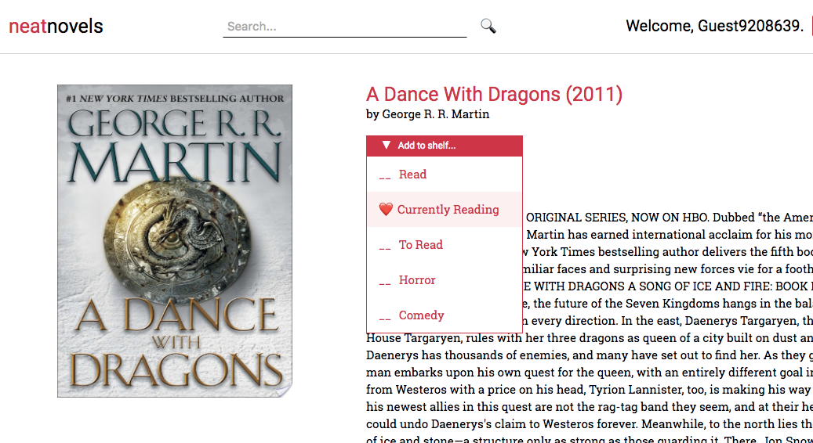
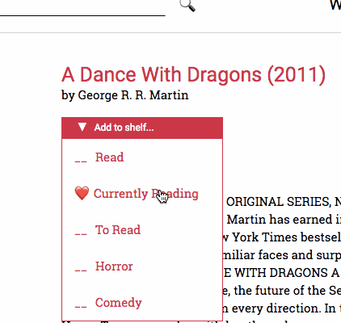
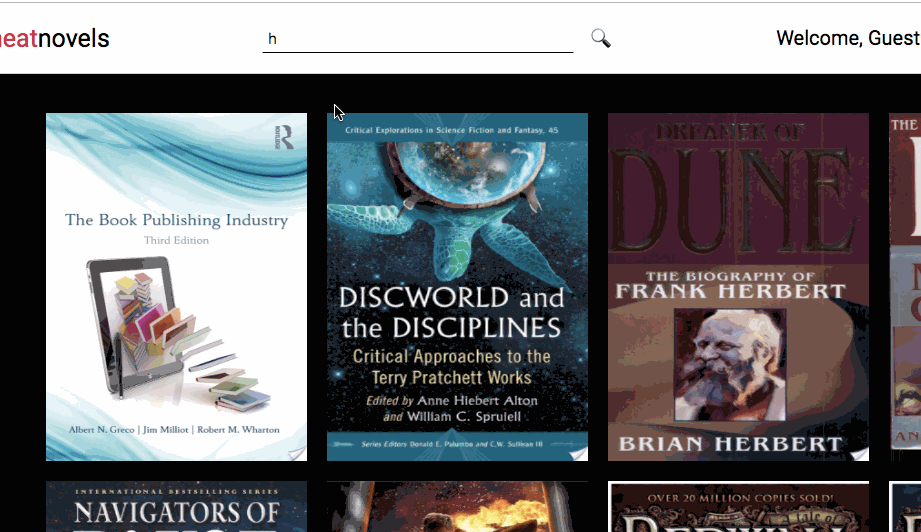

# Neatnovels

[Neatnovels][heroku-link] is a single page application that allows users to search for books and add to bookshelves. Inspired by goodreads, it is a full stack web app that uses Ruby on Rails on the backend, a PostgreSQL database, and React/Redux on the frontend.


## Features

### Books and Bookshelves
Users can search through books and add to custom bookshelves. A `shelvings` table joins bookshelves and books.


Protected bookshelves "Read", "Currently reading", and "To read" are mutually exclusive and cannot be deleted. A book added to one of these protected shelves will destroy the shelvings connecting the book to the other two protected shelves.



### Infinite Scroll
Initial rendering of the books index page sends a request for 12 books, ordered by title. Once the user scrolls near the bottom of the page, an event listener fires and sends a request for more books, passing the last book id received as the starting index for the backend query. updating the store once the response is received:

```javascript
//in constructor
this.state = { bookCount: 0, hasMore: true };
...

componentWillMount() {
  if (this.props.books.length === 0) {
    this.props.requestBooks(0);
  }
  document.addEventListener('scroll', this.handleScroll);
}

handleScroll() {
  if (document.body.scrollHeight - 200 <
      document.body.scrollTop + window.innerHeight &&
      this.state.hasMore === true ) {
      this.props.requestBooks(this.state.bookCount);
  }
}
```


Once the response contains less than 12 books, local state is updated and further requests are prevented:

```javascript
componentWillReceiveProps(newProps) {
  const newBookCount = newProps.books.length;
  let newHasMore = true;
  if (newBookCount % 12 !== 0) {
    newHasMore = false;
  }
  this.setState( {bookCount: newBookCount, hasMore: newHasMore });
}
```

### Dynamic Search
Users in `/search` or `/books` can enter queries into the search bar and books matching the string will render.


In other pages, submitting the query renders the search index component.

## Features Implementation
While the current features are complete, there are still many more possible additions:

### Advanced Search
Add additional search refinement (currently only though title and author).

### User Profiles
Allow users to upload a profile picture and share bookshelves with other users.

[heroku-link]: http//neatnovels.herokuapp.com
