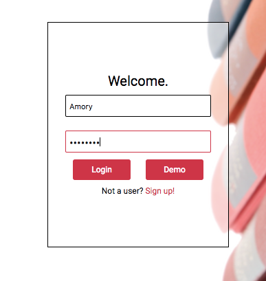

# Neatnovels

[Neatnovels][site-link] is a single page application that allows users to search for books and add to bookshelves. Inspired by goodreads, it is a full stack web app that uses Ruby on Rails on the backend, a PostgreSQL database, and React/Redux on the frontend.


[site-link]: http://www.neatnovels.club
## Features

### User Creation and Authentication
Users can easily sign up and be assured their password is securely stored (hashed via BCrypt). Prospective users can demo the site using the dynamic guest user generation with pre-seeded bookshelves.



### Books and Bookshelves
Users can search through books and add to custom bookshelves. A `shelvings` table joins bookshelves and books.


Protected bookshelves "Read", "Currently reading", and "To read" are mutually exclusive and cannot be deleted. A book added to one of these protected shelves will destroy any previous `shelving` joining the book to one of the other two protected shelves.


Users can also view and add `comment`s to books that are displayed on the book's show page. Non-users can only view.

### Infinite Scroll
Initial rendering of the books index page sends a request for 12 books, ordered by title. Once the user scrolls near the bottom of the page, an event listener fires and sends a request for more books, passing the current number of books in the store as the offset for the backend query. The store is updated once the response is received:

```javascript
//in constructor
this.state = { bookCount: 0, hasMore: true };
...

componentWillMount() {
  if (this.props.books.length === 0) {
    this.props.requestBooks(0);
  }
  document.addEventListener('scroll', this.handleScroll);
}

handleScroll() {
  if (document.body.scrollHeight - 200 <
      document.body.scrollTop + window.innerHeight &&
      this.state.hasMore === true ) {
      this.props.requestBooks(this.state.bookCount);
  }
}
```


Once the response contains less than 12 books, local state is updated and further requests are prevented:

```javascript
componentWillReceiveProps(newProps) {
  const newBookCount = newProps.books.length;
  let newHasMore = true;
  if (newBookCount % 12 !== 0) {
    newHasMore = false;
  }
  this.setState( {bookCount: newBookCount, hasMore: newHasMore });
}
```

### Dynamic Search
Users in `/search` or `/books` can enter queries into the search bar and books with titles or authors matching the string will render.


In other pages, submitting the query renders the `searchIndex` component.

## Features Implementation
While the current features are complete, there are still many more possible additions:

### Advanced Search
Add additional search refinement (currently only through title and author).

### User Profiles
Allow users to upload a profile picture and share bookshelves with other users.
